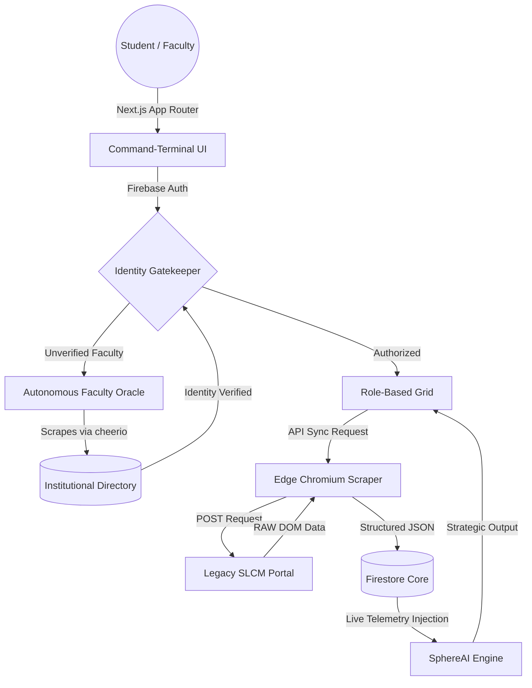

  

  <h1 align="center">STUDENTSPHERE</h1>
  
  

    <strong>The Autonomous, Zero-Trust Campus Nervous System.</strong> 
    <em>A masterclass in decentralized identity, edge-scraping, and context-aware AI.</em>
  

  

    
  

  

    
    
    
    
    
    
  

 

> **“Traditional academic portals are fragmented, static, and highly inefficient. StudentSphere is not a dashboard—it is an aerospace-grade, context-aware intelligence matrix that rewrites how institutions operate.”**

---

## 🔥 The Immaculate Tier: Core Innovations

### 👁️ Autonomous Faculty Oracle
No more manual verification. StudentSphere operates a server-side **Oracle API** (`/api/verify-faculty`) that autonomously parses and scrapes the official university directory to validate faculty credentials in real-time. 
* **Neural Normalization:** Automatically reconciles names and fuzzy-matches titles (stripping "Dr.", "Prof.", etc.).
* **Instant Rejection:** Imposters are locked out at the edge layer, ensuring an uncompromised faculty grid.
* **Frictionless Onboarding:** True Zero-Touch provisioning for verified academic staff.

### 🛡️ Template-Enforced Zero-Trust Data Matrix
Inputs on StudentSphere aren't just strings; they are strict, hardware-level identity vectors.
* **Surgical Validation Matrices:** Batch 2027 constraints enforce 14-digit alphanumeric caps; Batches 2028+ are locked to strict 10-digit numeric codes. 
* **Firestore RBAC Edge:** Database interactions are gated by severe role-based access control (RBAC). The database is entirely invisible to unregistered entities.

### 🧠 SphereAI: Context-Aware Intelligence
Beyond standard LLM wrappers, SphereAI is an intelligence core injected directly with real-time academic telemetry. 
* **Proactive Interventions:** It calculates attendance shortages before you do.
* **Ultra-Low Latency:** Powered by Groq's Llama 3.3 inferencing, it formulates buffer zones, project strategies, and study plans instantaneously.

### ⚡ Edge SLCM Synchronization (The Ghost Protocol)
A devastatingly fast, asynchronous data extraction engine leveraging `@sparticuz/chromium`. By bypassing serverless memory limitations, StudentSphere acts as an invisible browser, pulling raw attendance and timetable data directly from legacy university SLCM portals in under 3 seconds.

---

## 🛠️ The Technology Engine

| Layer Framework | Technology Engine | Architectural Purpose & Execution |
| :--- | :--- | :--- |
| **Core Framework** | `Next.js 15` | App Router paradigm for nested layouts, server-side Oracle execution, and optimal edge streaming. |
| **Identity Guard** | `Firebase Auth` | Institutional SSO integration with strict loop-verification protocols and Zero-Trust policies. |
| **Data Matrix** | `Firestore` | Schemaless, scalable NoSQL document storage for exceptionally flexible and secure node profiles. |
| **Scraping Core**| `Puppeteer-Core` | Headless Chromium mechanics optimized for Vercel Serverless SLCM data synthesis. |
| **Physics & UI** | `Framer Motion` | Fluid, hardware-accelerated UI physics bridging React state and DOM animations seamlessly. |
| **Neural Logic** | `Groq Cloud` | Ultra-low-latency Llama 3.3 API powering the deep reasoning of the SphereAI framework. |

---

## 📐 System Architecture Matrix

---

## 🗺️ The Genesis Roadmap

- [x] **Phase 1: Foundations** - Auth, Command-Terminal aesthetics, Core Scraping logic.
- [x] **Phase 2: Faculty Hub** - Real-time Attendance, Assignments, and Marks management.
- [x] **Phase 3: Intelligence** - SphereAI context-aware neural integration.
- [x] **Phase 4: Identity Hardening** - Autonomous Faculty Oracle implementation and Grid Symmetry.
- [x] **Phase 5: Production Deployment** - Vercel Edge configuration and Firestore security publication.
- [ ] **Phase 6: Collaborative Core** - Encrypted peer-to-peer forum and batch broadcasts.

---

## 📬 Contact & Collaboration

Architectural deep-dives, access provisioning, and system metrics are available upon request.

* **Lead Architect:** Shrey Bansal
* **Secure Comm:** [shreybansal365@gmail.com](mailto:shreybansal365@gmail.com)
* **GitHub Core:** [@shreybansal365](https://github.com/shreybansal365)

   
  <strong>Made with ❤️ by Shrey Bansal — Manipal University Jaipur 2026.</strong>

