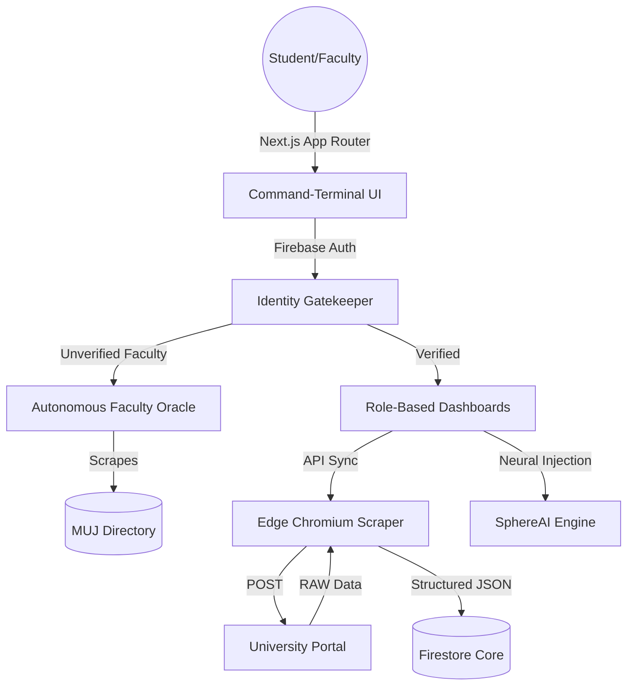

  

  <h1 align="center">STUDENTSPHERE</h1>
  
  

    <strong>The Autonomous, Zero-Trust Campus Nervous System.</strong> 
    <em>An elite integration of decentralized identity, edge-scraping, and context-aware intelligence.</em>
  

  

    
  

  

    
    
    
    
    
    
  

 

> **“Traditional academic portals are fragmented and inefficient. StudentSphere is an aerospace-grade, context-aware intelligence matrix that rewrites how institutions operate.”**

---

## ⚡ The Immaculate Tier: Core Innovations

### 👁️ Autonomous Faculty Oracle
StudentSphere operates a server-side **Oracle API** (`/api/verify-faculty`) that autonomously scrapes the official university directory to validate faculty credentials in real-time. 
* **Neural Normalization:** Automatically reconciles names and fuzzy-matches titles (stripping "Dr.", "Prof.", etc.).
* **Instant Rejection:** Imposters are locked out at the edge layer, ensuring an uncompromised faculty grid.

### 🛡️ Template-Enforced Zero-Trust Data Matrix
* **Surgical Validation:** Batch-specific constraints (14-digit alphanumeric for 2027; 10-digit numeric for 2028+).
* **Role-Based Access Control:** All database interactions are gated by strict Firestore RBAC policies.

### 🧠 SphereAI: Context-Aware Intelligence
Beyond standard LLM wrappers, SphereAI is fed directly with real-time academic telemetry. 
* **Proactive Interventions:** Calculates attendance shortages and suggests "Safe-Miss" buffer zones.
* **Low-Latency Logic:** Powered by Groq's Llama 3.3 for instantaneous strategic output.

### ⚡ Ghost Protocol: Edge SLCM Synchronization
An asynchronous data extraction engine using `@sparticuz/chromium` to bypass serverless constraints, pulling raw university data in under 3 seconds.

---

## 🛠️ The Technology Engine

| Layer | Engine | Purpose |
| :--- | :--- | :--- |
| **Core** | `Next.js 15` | App Router paradigm for nested layouts and streaming. |
| **Identity** | `Firebase Auth` | Institutional Outlook SSO and Zero-Trust gatekeeping. |
| **Data** | `Firestore` | NoSQL document storage for secure, scalable node profiles. |
| **Scraping**| `Puppeteer-Core` | Headless browser mechanics for SLCM data synthesis. |
| **Physics** | `Framer Motion` | Fluid UI physics bridging React state and DOM animations. |
| **Neural** | `Groq Cloud` | Low-latency Llama 3.3 API powering SphereAI logic. |

---

## 📐 System Architecture

---

## 📬 Contact & Collaboration

* **Lead Architect:** [Shrey Bansal](https://github.com/shreybansal365)
* **Secure Comm:** [shreybansal365@gmail.com](mailto:shreybansal365@gmail.com)

   
  <strong>Built with ❤️ by Shrey Bansal — Manipal University Jaipur 2026.</strong>

