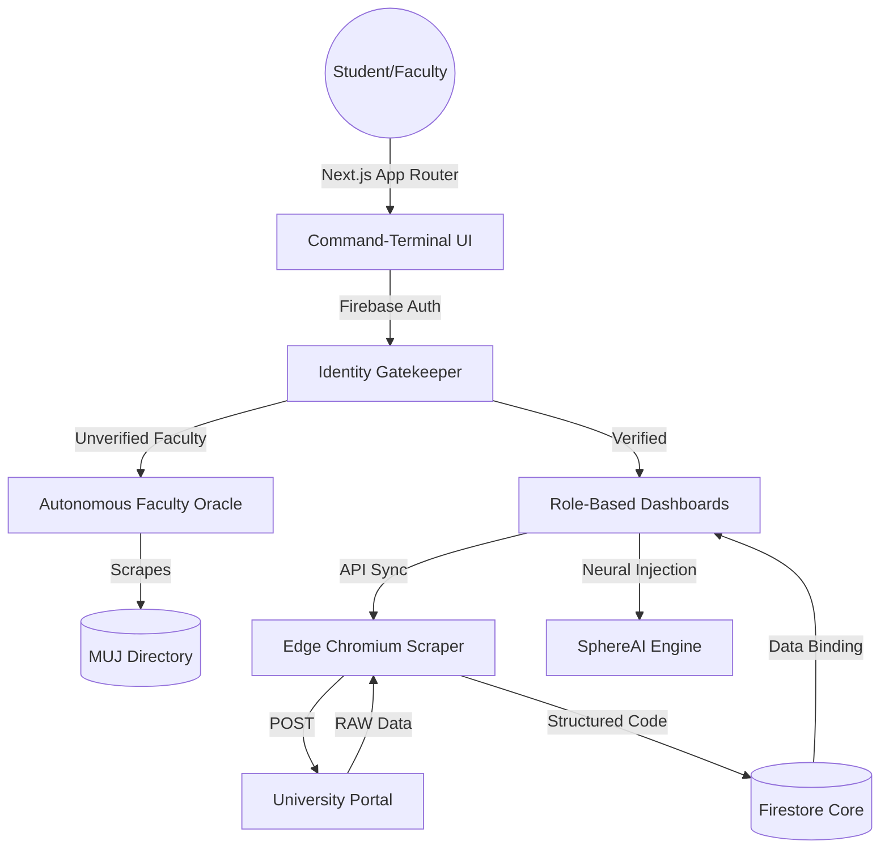

  
  
  # 🌐 StudentSphere
  ### The Ultimate Decentralized Campus Ecosystem & Identity Oracle
  
  
  
  
  
  

  **Architected & Developed Solo by [Shrey Bansal](https://github.com/shreybansal365)**

---

## ⚡ The Vision

Traditional university portals are fragmented, slow, and outdated. **StudentSphere** was conceptualized to be the definitive "System of Record" for the modern academic institution. Engineered with a **high-fidelity command-terminal aesthetic**, it isn't just a dashboard; it's a context-aware academic nervous system that bridges the gap between raw institutional data and actionable student intelligence.

From live attendance tracking with "Safe-Miss" projections to an AI Strategist that plans your study schedule based on real-time SLCM data, StudentSphere is built for the absolute edge of academic tech.

---

## 🚀 The Immaculate Tier: Key Innovations

### 👁️ Autonomous Faculty Oracle
No manual faculty verification required. The system features a server-side **Oracle API** (`/api/verify-faculty`) that autonomously scrapes the official university directory to validate teacher identities in real-time. It automatically reconciles names, fuzzy-matches titles (stripping "Dr.", "Prof.", etc.), enforces strict institutional nomenclature, and rejects imposters instantly.

### 🛡️ Template-Enforced Zero-Trust Architecture
Built on a true **Zero-Trust architecture**. Inputs are not just strings; they are strict identity vectors.
- **Surgical Validation Matrices:** Batch 2027 uses 14-digit alphanumeric caps; Batches 2028+ are locked to 10-digit numeric codes. 
- **Firestore RBAC Edge:** Database interactions are gated by strict role-based access control. Students see only their data; Faculty control only their matrices.

### 🧠 SphereAI: Context-Aware Intelligence
Beyond simple LLM wrappers, SphereAI is an intelligence core fed directly with your real-time academic data. It knows your attendance shortages before you do and formulates buffer zones, project strategies, and study plans via Groq's low-latency Llama 3.3 inferencing.

### 🕵️ Edge SLCM Synchronization
A custom-built asynchronous scraping engine leveraging `@sparticuz/chromium` to bypass serverless memory constraints, extracting raw attendance and timetable data directly from MUJ SLCM portals in under 3 seconds.

---

## 🛠️ Specialized Tech Stack

| Domain | Engine | Rationale & Architecture |
| :--- | :--- | :--- |
| **Core** | `Next.js 15` | App Router paradigm for nested layouts, server-side Oracle execution, and streaming. |
| **Identity Guard** | `Firebase Auth` | Institutional Outlook SSO integration and strict verification looping. |
| **Data Matrix** | `Firestore` | NoSQL document storage for highly flexible, secure student/faculty profiles. |
| **Data Extraction** | `Puppeteer-Core` | Edge-compatible headless browser mechanics for SLCM data synthesis. |
| **Physics & UI** | `Framer Motion` | Fluid, aerospace-grade UI physics bridging React state and DOM animations. |
| **Neural Processing** | `Groq Cloud` | Ultra-low-latency Llama inference powering the SphereAI logical core. |

---

## 📐 System Architecture

---

## 🗺️ Roadmap to Genesis

- [x] **Phase 1: Foundations** - Auth, Layout, Core Scraping logic.
- [x] **Phase 2: Faculty Hub** - Attendance, Assignments, and Marks management.
- [x] **Phase 3: Intelligence** - SphereAI context-aware integration.
- [x] **Phase 4: Identity Hardening** - Autonomous Oracle implementation and Grid Symmetry.
- [/] **Phase 5: Collaborative Core** - Peer-to-peer forum and encrypted batch broadcasts.
- [ ] **Phase 6: Native Deployment** - Progressive Web App (PWA) transformation.

---

## 📬 Contact & Collaboration

System metrics and architectural deep-dives are available upon request.

- **Lead Architect:** Shrey Bansal
- **Secure Comm:** [shreybansal365@gmail.com](mailto:shreybansal365@gmail.com)
- **GitHub Core:** [@shreybansal365](https://github.com/shreybansal365)

   
  Architected with ❤️ by Shrey Bansal — Manipal University Jaipur 2026.

