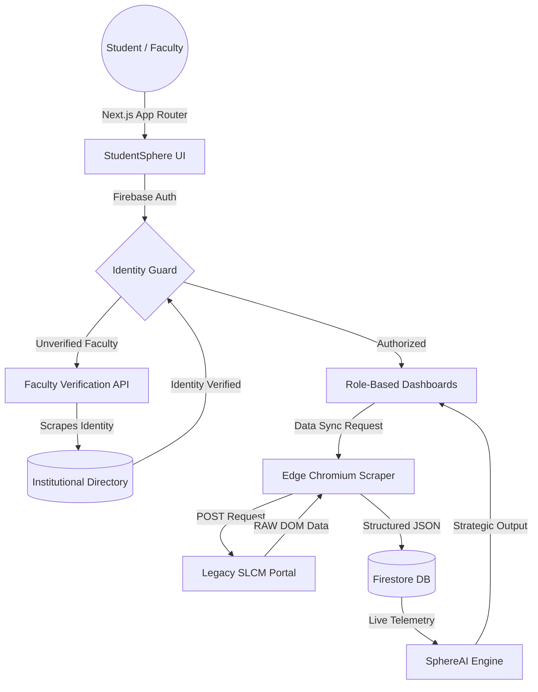

  

  <h1 align="center">StudentSphere</h1>
  
  

    <strong>A next-generation, context-aware campus management platform.</strong> 
    <em>Built with a Zero-Trust architecture, edge-scraping capabilities, and AI-driven insights.</em>
  

  

    
  

  

    
    
    
    
    
    
  

 

> **Traditional academic portals are fragmented and static. StudentSphere bridges the gap between institutional data and actionable intelligence, providing a unified, context-aware experience for both students and faculty.**

---

## 🚀 Core Capabilities

### 👁️ Autonomous Faculty Authorization
StudentSphere incorporates a server-side verification layer (`/api/verify-faculty`) that autonomously parses the official university directory to validate faculty credentials. 
* **Data Normalization:** Automatically reconciles names and standardizes titles to ensure consistent matching.
* **Proactive Security:** Unverified access attempts are rejected at the edge, maintaining the integrity of the faculty portal.

### 🛡️ Zero-Trust Architecture
Data security and access controls are strictly enforced at the database level.
* **Input Validation:** Batch-specific constraints (e.g., locking to specific numeric or alphanumeric formats based on enrollment year).
* **Firestore RBAC:** Role-Based Access Control policies ensure users can only access and modify their authorized data scopes.

### 🧠 SphereAI: Context-Aware Intelligence
Integrating with real-time academic telemetry, SphereAI provides proactive insights rather than simple LLM responses.
* **Predictive Analytics:** Accurately calculates attendance trajectories and suggests optimal buffer zones.
* **Low-Latency Logic:** Powered by Groq's LLaMA 3.3, delivering near-instantaneous strategic recommendations.

### ⚡ Edge SLCM Synchronization
An asynchronous data extraction engine using `@sparticuz/chromium`. Designed to operate within serverless constraints, it securely and rapidly pulls raw attendance and timetable data from legacy institutional portals.

---

## 🛠️ Technical Architecture

| Component | Technology | Purpose |
| :--- | :--- | :--- |
| **Framework** | `Next.js 15` | App Router paradigm for nested layouts, secure API routes, and optimized streaming. |
| **Authentication**| `Firebase Auth` | Institutional SSO integration with strict verification protocols. |
| **Database** | `Firestore` | Scalable NoSQL document storage for complex, hierarchical user profiles. |
| **Scraping Engine**| `Puppeteer-Core` | Headless Chromium mechanics tailored for Vercel Serverless execution. |
| **UI & Animation**| `Framer Motion` | Hardware-accelerated transitions that bridge React state with fluid DOM elements. |
| **AI Inference** | `Groq Cloud` | Ultra-low-latency API powering the reasoning framework for SphereAI. |

---

## 📐 System Flow Diagram

---

## 🗺️ Project Roadmap

- [x] **Phase 1: Foundations** - Core authentication, layout structures, and scraping logic.
- [x] **Phase 2: Faculty Dashboard** - Real-time attendance, assignment, and academic marks management.
- [x] **Phase 3: Intelligence** - Integration of the SphereAI context-aware engine.
- [x] **Phase 4: Identity Hardening** - Implementation of the automated faculty verification process.
- [x] **Phase 5: Deployment** - Production release on Vercel with strict Firestore security rules.
- [ ] **Phase 6: Collaboration** - Encrypted peer-to-peer discussions and batch-wide broadcasting.

---

## 📬 Contact Information

For access provisioning, architectural discussions, or collaboration inquiries:

* **Lead Developer:** Shrey Bansal
* **Email:** [shreybansal365@gmail.com](mailto:shreybansal365@gmail.com)
* **GitHub:** [@shreybansal365](https://github.com/shreybansal365)

   
  <strong>Developed by Shrey Bansal — Manipal University Jaipur 2026.</strong>

