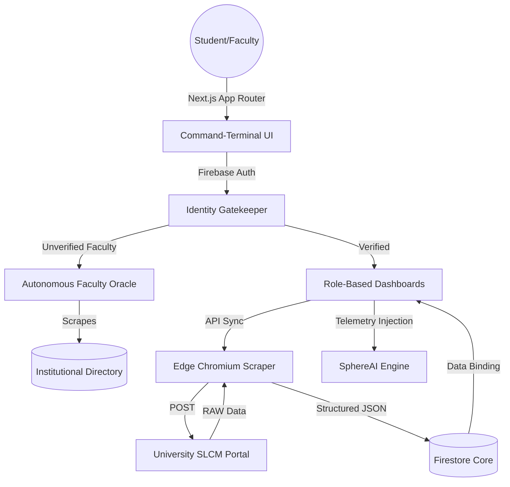

  
  
  <h1 align="center">StudentSphere</h1>
  

    <strong>The Autonomous, Zero-Trust Campus Nervous System</strong>
     
     
    <a href="https://studentsphere1234.vercel.app/"><strong>Explore the Deployment »</strong></a>
     
     
    
    
    
    
  

---

## ⚡ The Paradigm Shift

Traditional academic portals are fragmented, static, and highly inefficient. **StudentSphere** was architected to be the definitive **"System of Record"** for the modern academic institution. 

Engineered with an aerospace-grade, high-fidelity command-terminal aesthetic, StudentSphere transcends standard dashboards. It acts as a context-aware academic nervous system—bridging the gap between raw institutional data and actionable student intelligence in real-time.

---

## 🚀 The Immaculate Tier: Core Innovations

### 👁️ Autonomous Faculty Oracle
No more manual verification. StudentSphere operates a server-side **Oracle API** (`/api/verify-faculty`) that autonomously parses and scrapes the official university directory to validate faculty credentials in real-time. 
* **Neural Normalization:** Automatically reconciles names and fuzzy-matches titles (stripping "Dr.", "Prof.", etc.).
* **Instant Rejection:** Imposters are locked out at the edge layer, ensuring an uncompromised faculty grid.

### 🛡️ Template-Enforced Zero-Trust Data Matrix
Inputs on StudentSphere aren't just strings; they are strict identity vectors.
* **Surgical Validation Matrices:** Batch 2027 constraints enforce 14-digit alphanumeric caps; Batches 2028+ are locked to 10-digit numeric codes. 
* **Firestore RBAC Edge:** Database interactions are gated by strict role-based access control. The database is invisible to unregistered entities.

### 🧠 SphereAI: Context-Aware Intelligence
Beyond standard LLM wrappers, SphereAI is an intelligence core injected directly with real-time academic telemetry. 
* **Proactive Interventions:** It calculates attendance shortages before you do.
* **Low-Latency Logic:** Powered by Groq's Llama 3.3 inferencing, it formulates buffer zones, project strategies, and study plans instantaneously.

### 🕵️ Edge SLCM Synchronization
An asynchronous data extraction engine leveraging `@sparticuz/chromium`. By bypassing serverless memory constraints, StudentSphere pulls raw attendance and timetable data directly from standard university SLCM portals in under 3 seconds.

---

## 🛠️ The Technology Engine

| Layer | Technology | Architectural Purpose |
| :--- | :--- | :--- |
| **Core Framework** | `Next.js 15` | App Router paradigm for nested layouts, server-side Oracle execution, and optimal edge streaming. |
| **Identity Guard** | `Firebase Auth` | Institutional SSO integration with strict loop-verification protocols. |
| **Data Matrix** | `Firestore` | NoSQL document storage for exceptionally flexible and secure node profiles. |
| **Scraping Engine**| `Puppeteer-Core` | Headless browser mechanics optimized for serverless SLCM data synthesis. |
| **Physics & UI** | `Framer Motion` | Fluid, hardware-accelerated UI physics bridging React state and DOM animations. |
| **Neural Core** | `Groq Cloud` | Ultra-low-latency Llama inference powering the SphereAI logical framework. |

---

## 📐 System Architecture

---

## 🗺️ Genesis Roadmap

- [x] **Phase 1: Foundations** - Auth, Command-Terminal layout, Core Scraping logic.
- [x] **Phase 2: Faculty Hub** - Real-time Attendance, Assignments, and Marks management.
- [x] **Phase 3: Intelligence** - SphereAI context-aware neural integration.
- [x] **Phase 4: Identity Hardening** - Autonomous Oracle implementation and Grid Symmetry.
- [x] **Phase 5: Production Deployment** - Vercel Edge configuration and Firestore security publication.
- [ ] **Phase 6: Collaborative Core** - Encrypted peer-to-peer forum and batch broadcasts.

---

## 📬 Contact & Collaboration

System metrics and architectural deep-dives are available upon request.

- **Lead Architect:** Shrey Bansal
- **Secure Comm:** [shreybansal365@gmail.com](mailto:shreybansal365@gmail.com)
- **GitHub Core:** [@shreybansal365](https://github.com/shreybansal365)

   
  Architected with ❤️ by Shrey Bansal — Manipal University Jaipur 2026.

