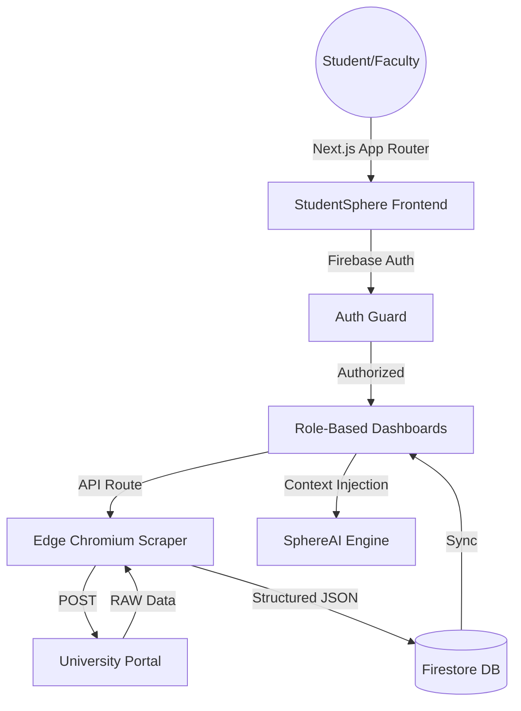

  
  
  # 🌐 StudentSphere
  ### The Ultimate Decentralized Campus Ecosystem
  
  
  
  
  
  

  **Architected & Developed Solo by [Shrey Bansal](https://github.com/shreybansal365)**

---

## ⚡ The Vision

Traditional university portals are often fragmented, slow, and outdated. **StudentSphere** was conceptualized to be the definitive "System of Record" for the modern student. It isn't just a dashboard; it's a context-aware academic assistant that bridges the gap between raw data and actionable insights.

From live attendance tracking with "Safe-Miss" projections to an AI Strategist that plans your study schedule based on real-time SLCM data, StudentSphere is engineered for the future of education.

---

## 🚀 Key Innovations

### 🧠 SphereAI: Context-Aware Intelligence
Beyond simple LLM integration, SphereAI is fed directly with your real-time academic data. It knows your attendance shortages before you do and suggests buffer zones for your upcoming week.

### 🛡️ Production-Grade Security
Built on a **Zero-Trust architecture**. All database interactions are gated by strict role-based access control (RBAC) at the Firestore edge. Students see only their data; Faculty control only their courses.

### 🕵️ Edge Scraping Engine
A custom-built scraping pipeline leveraging `@sparticuz/chromium` to bypass serverless memory constraints, fetching real-time data from MUJ SLCM portals in under 3 seconds.

---

## 🛠️ Specialized Tech Stack

| Domain | technology | Rationale |
| :--- | :--- | :--- |
| **Core** | `Next.js 15` | App Router paradigm for nested layouts and streaming. |
| **Identity** | `Firebase Auth` | Secure Microsoft Outlook SSO integration. |
| **Real-time DB** | `Firestore` | NoSQL architecture for flexible student profiles. |
| **Scraping** | `Puppeteer-Core` | Edge-compatible headless browser integration. |
| **Motion** | `Framer Motion` | Fluid, "Apple-like" layout transitions. |
| **AI Runtime** | `Groq Cloud` | Low-latency Llama 3.3 inference for SphereAI. |

---

## 📐 System Architecture

---

## 🗺️ Roadmap

- [x] **Phase 1: Foundations** - Auth, Layout, Core Scraping logic.
- [x] **Phase 2: Faculty Hub** - Attendance, Assignments, and Marks management.
- [x] **Phase 3: Intelligence** - SphereAI context-aware integration.
- [/] **Phase 4: Collaborative Core** - Peer-to-peer forum and batch broadcasts.
- [ ] **Phase 5: Native Integration** - Progressive Web App (PWA) for mobile-first experience.

---

## 📬 Contact & Collaboration

If you're interested in the technical implementation or potential collaboration:

- **Lead Developer:** Shrey Bansal
- **Email:** [shreybansal365@gmail.com](mailto:shreybansal365@gmail.com)
- **GitHub:** [@shreybansal365](https://github.com/shreybansal365)

   
  Built with ❤️ by Shrey Bansal — Manipal University Jaipur 2026.

